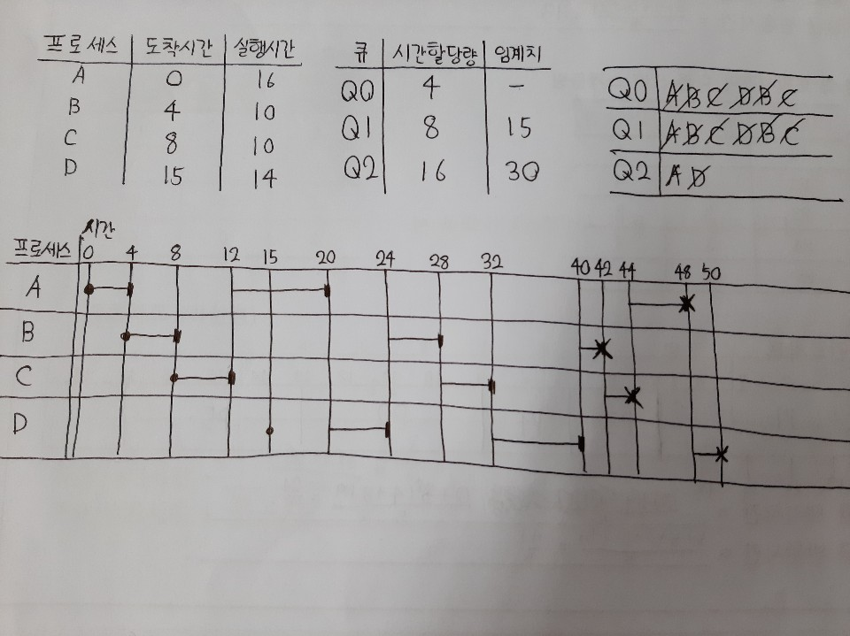

## MLQ와 MFQ [스케줄러 알고리즘]

### 1. MLQ와 MFQ

#### 1-1. MLQ

MLQ는 Multi-Level Queue의 약자로서,
기존에 하나의 준비 큐를 이용하여 프로세스들을 관리했다면
MLQ에서는 프로세스들을 우선순위에 따라 각각 다른 준비 큐에 담아서 관리한다.

각각의 큐는 구현하는 스케줄러 알고리즘이 다르다.
대부분 RR을 사용하기는 하나 우선순위가 떨어지는 큐의 경우 FCFS를 사용하는 경우도 있다.

하지만 MLQ의 동작 방식은 한 번 프로세스가 큐에 들어가게 되면 그 큐만을 계속 돌게 된다는 단점을 가지고 있다.
그래서 이 방식을 보완한 MFQ가 많이 사용되고 있다.

#### 1-2. MFQ

MFQ는 Multi-FeedBack Queue의 약자로서,
MLQ는 각각의 큐에서만 프로세스가 돌고 큐 사이의 이동은 불가했었는데
이로 인해 생기는 기아 상태를 극복하기 위해서 큐 사이의 이동이 가능하도록 알고리즘을 짠 것이 MFQ이다.

MFQ는 기본적으로 MLQ와 마찬가지로 대부분 RR 스케줄러 알고리즘을 이용하여 준비 큐를 돌리고
우선순위가 낮은 큐의 경우에는 FCFS를 사용할 때도 있다.

처음 프로세스가 준비 큐에 도착하게 되면 가장 우선순위가 높은 큐에 들어가게 된다.
우선순위가 높은 큐일 수록 시간 할당량이 작아서 빠르게 돌아가는데
한 번 시간 할당량이 다 되어 실행을 했을 경우에는 우선순위가 바로 아래인 큐에 들어가게 된다.

그리고 기아 상태를 극복하기 위해서 Aging 기법을 사용하는데
Aging 기법은 아무 일도 하지 않은 프로세스를 '늙게'하여 프로세스를 다른 큐에 옮기는 기법이다.
각각의 큐마다 임계치가 정해져 있는데 그 일정한 시간 동안 CPU를 할당 받지 못한 프로세스가 있다면
우선순위가 하나 높은 큐로 옮겨준다.

이런식으로 MFQ가 진행되는데 이는 직접 해보지 않으면 알기 힘드므로
한 번 해보도록 하겠다.

### 2. MFQ 직접 사용하기

위의 표에서 특이한 점이라면 Q0의 임계치가 없다는 점인데
이는 잘 생각해보면 당연한 것이다.
임계치 동안 프로세스가 일을 하지 않으면 그 프로세스를 윗 단계의 큐로 옮기게 된다.
그런데 Q0는 가장 우선순위가 높은 큐이므로 그 이상 올라갈 수 없으므로 임계치가 존재하지 않은 것이다.
그리고 대부분 임계치는 가장 우선순위가 높은 큐를 제외하면 내려갈 수록 길어진다.
시간할당량(TS)도 마찬가지로 내려갈 수록 길어진다.

그럼 바로 MFQ가 어떻게 동작하는지 하나하나 알아보도록 하겠다.

1.  0초 때 프로세스 A가 도착하므로 Q0에 프로세스 A를 넣고 시간 할당량인 4만큼 실행한 뒤
    Q1로 프로세스 A를 옮긴다.
2.  4초 때 프로세스 B가 도착하므로 프로세스 B를 Q0에 넣고 실행한다. 그 후 프로세스 B를 Q1로 옮긴다.
3.  8초 때 프로세스 C가 도착하므로 프로세스 C를 Q0에 넣고 실행한다. 그 후 프로세스 C를 Q1로 옮긴다.
4.  Q0에 존재하는 프로세스가 없으므로 Q1에 있는 프로세스를 확인하는데
    Q1에 있는 프로세스는 순서대로 A -> B -> C이다.
    따라서 프로세스 A를 실행하는데 Q1의 시간 할당량은 8초이므로 8초동안 실행한다.
5.  20초가 되었는데 15초에 프로세스 D가 도착하였으므로 프로세스 D가 Q0에 삽입된다.
    프로세스 A는 실행하였으므로 Q2에 삽입하고 프로세스 D를 실행하며
    프로세스 D를 Q2에 삽입한다.
6.  24초 때 Q0는 비었고 Q1에는 프로세스 B, C가 존재하므로 차례대로 4초씩 실행하여 Q2로 이동시킨다.